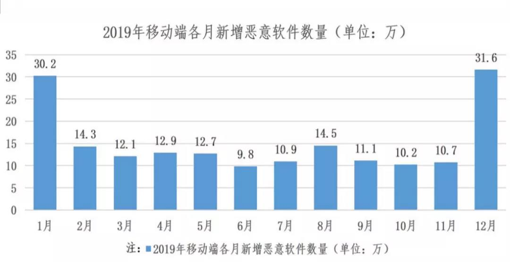
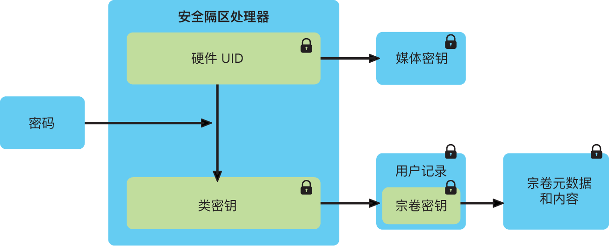
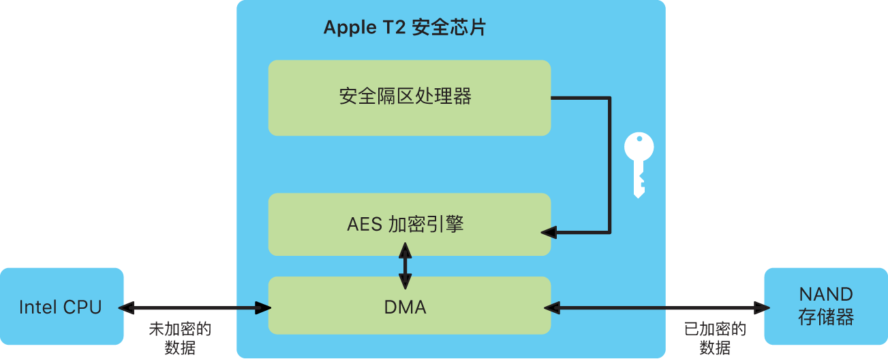
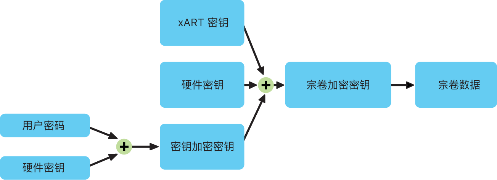

<h1 align=center>信息安全技术课程 期末PROJECT</h1>

<h1 align=center>Mobile System Security on Apple's Device</h1>

<h1 align=center>          ——       苹果设备上的信息安全 </h1>

<h1 align=center>18340052  何泽</h1>

[TOC]

## Ⅰ 前言与背景

现如今，移动互联网新型应用层出不穷，5G网络正式商用及智能终端价格持续走低，极大促进了移动互联网的稳步发展。当前，智能终端和云计算的普及应用加速推动IT与CT融合，促进了移动互联网的高速发展。手机作为移动互联网最重要最直接的接入终端，已从最初的只能打电话和发短信，发展成为集搜索、社交、游戏、支付、位置服务和移动办公等功能应用于一身的智能终端，俨然变成一台随身携带的个人计算机。

尤其是2020年5G手机正式普及，人们暴露在互联网的时间也将越来越长， 正是在这种局面下，移动设备终端系统的安全问题变得越来越重要。

## Ⅱ 问题描述

2020年，信息安全挑战早已从传统PC端蔓延至手机，且大有愈演愈烈之势。

2019年Android平台新增恶意程序样本180.9万个，平均每天新增手机恶意软件样本约5千个，恶意程序主要体现在恶意扣费、资费消耗、隐私窃取。

根据DCCI《中国移动安全产业链生态发展报告》显示：移动生态产业链的每个环节都存在移动安全问题，云计算的兴起，加速了移动互联网的发展，但其特殊的商业服务模式及计算模式也带来了更大的安全隐患。在我看来，现如今移动系统信息安全已经不再仅仅局限于传统的垃圾短信、骚扰电话等恶意骚扰威胁，而是演变成为云服务平台安全、智能管道安全和智能终端信息安全的三维问题，包括了云服务安全、恶意软件威胁、伪基站、无线传播渠道安全、终端操作系统安全及设备安全等诸多内容。

现在可以说每个人都有手机，并且手机不离身，每天每个人都要在手机上处理大量的事情，那么移动系统安全就显得格外重要。既然移动系统安全这么重要，苹果、微软、华为等各大厂商自然也都在隐私保护与系统安全上做了很多保护措施。

而在我看来，在这之中苹果公司在这方面做的是相对成功的，所以接下来我将以苹果公司所做的隐私保护与安全措施为基础探讨移动系统安全。

## Ⅲ 解决方法

> 之所以选择以苹果公司所做的隐私保护与安全措施为基础探讨移动系统安全，是因为他们自己设计了硬件和软件，二者紧密联系、共同协作从而达到信息安全的目标，自定安全性硬件为关键的安全性功能提供了支持。软件保护保障了操作系统和第三方 App 的安全。服务提供了安全和及时的软件更新机制，建立了更安全的 App 生态系统，保障了通信和支付的安全，以及提供了更安全的互联网体验。这样不仅保护设备及其数据，还保护整个生态系统，包括用户在本地、网络上以及使用互联网核心服务执行的所有操作。
>
> 下面将从硬件和软件两个方面来探讨如何保证移动系统信息安全。

### 一、硬件

#### 1. 概述

安全软件需要以硬件内建的安全性为基础。因此，苹果设备的芯片设有安全性功能，其中包括支持系统安全性功能的自定 CPU 功能以及安全性功能专用的芯片。这之中最关键的部件是安全隔区协处理器，安全隔区为静态数据加密、安全启动以及生物识别提供了支持。此外还内置专用的 AES 硬件引擎，可在读写文件时实现线速加密。这确保了“数据保护”和“文件保险箱”在保护用户文件的同时不会将长期有效的加密密钥暴露给 CPU 或操作系统，确保了软件的最底层不被篡改。

#### 2. 安全隔区

`安全隔区`是一个独立于主处理器外的安全协处理器，其中包括基于硬件的密钥管理器，可提供额外的安全性保护。密钥数据在安全隔区片上系统 (SoC) 中加密，它包括一个随机数生成器。

安全隔区还会维护其加密操作的完整性，即使在设备内核遭到入侵的情况下。安全隔区与应用程序处理器之间的通信受到严格的控制，方法是将其隔离到一个中断驱动的邮箱以及共享的内存数据缓冲区。

安全隔区包括一个专用的`安全隔区 Boot ROM`。与应用程序处理器 Boot ROM 类似，安全隔区 Boot ROM 也是不可更改的代码，用于为安全隔区建立硬件信任根。它还基于定制的 L4 系列微内核运行安全隔区操作系统。

设备启动时，安全隔区 Boot ROM 会创建一个临时内存保护密钥，此密钥与设备的唯一 ID (UID) 相关联，并用于对设备内存空间的安全隔区部分进行加密。安全隔区内存也使用内存保护密钥进行认证，使用了完整性树防止安全性要求极高的安全隔区内存出现重放，并使用储存在芯片上 SRAM 中的内存保护密钥和随机数进行认证。

在手机中，文件在写入到数据宗卷时会使用与安全隔区的 UID 关联的密钥和反重放随机数进行加密，反重放随机数使用由硬件随机数生成器生成的熵。反重放随机数支持内置于专用的非易失性内存集成电路 (IC) 中。

此外，安全隔区与用于储存反重放随机数的安全储存 IC 是配对的。安全储存 IC 设计为使用不可更改的 ROM 代码、硬件随机数生成器、加密引擎和物理篡改检测。为了读取和更新随机数，安全隔区和储存 IC 采用安全协议来确保对随机数的排他访问。

以上便是安全隔区协处理器，不仅可驱动指纹识别，为安全启动和加密存储功能打下坚实基础，此外还整合了多个独立的控制器，包括系统管理控制器、音频控制器和固态硬盘控制器，在芯片层面为重要安全功能打下了坚实基础。

#### 3.专用 AES 引擎

每台搭载安全隔区的设备都具有专用的 `AES-256 加密引擎`，它内置于闪存与主系统内存之间的 DMA 路径中，可以实现高效的文件加密。闪存子系统位于隔离的总线上，该总线仅被授权通过 DMA 加密引擎访问包含用户数据的内存。

安全隔区会安全地生成自己的密钥，即唯一 ID (UID)、设备组 ID (GID) 和其他密钥，然后按需安全地抹掉已存储的密钥。这些密钥是 AES-256 位密钥，密钥已在制造过程中被固化或编译在安全隔区中。任何软件或固件都无法直接读取这些 ID，而只能查看加密或解密操作结果。这些加密或解密操作则由植入于芯片中的专用 AES 引擎将这些 UID 或 GID 用作密钥来执行。

应用程序处理器和安全隔区都有其各自的 UID 和 GID，而只有专用于安全隔区的 AES 引擎才能使用安全隔区 UID 和 GID。

例如生成加密密钥，在安全隔区中运行的软件利用 UID 来保护设备特定的密钥。有了 UID，就可以通过加密方式将数据与特定设备捆绑起来。例如，用于保护文件系统的密钥层级就包括 UID，因此如果将内置 SSD 储存设备从一台设备整个移至另一台设备，文件将不可访问。UID 与设备上的任何其他标识符都无关。其他受保护的特定设备密钥包括触控 ID 或面容 ID 数据。

除了 UID 和 GID，手机中的所有其他加密密钥都由系统的`随机数生成器 (RNG) `使用基于 `CTR_DRBG` 的算法创建。系统熵是在启动期间从时间变化以及设备启动后从中断计时中生成的。在安全隔区内部，生成的密钥使用的是其真正的硬件随机数生成器，它基于多个环形振荡器并经过 `CTR_DRBG` 后处理。

以上便是专用 AES 引擎，保护加密密钥的安全，同时提供加密存储和数据保护能力。

### 二、软件

#### 1. 系统安全性

在上述硬件独特功能的基础上，系统安全性可以最大程度地提高设备上操作系统的安全性，而不影响其可用性。系统安全性覆盖了启动过程、软件更新以及操作系统中正在进行的操作。

##### ①  随机数生成

`密码学伪随机数生成器 (CPRNG) `是安全软件的重要基石，它负责聚合系统中的原始熵并为内核和用户空间的使用者提供安全的随机数。

内核 CPRNG 源自启动过程中的多个熵源并存在于设备的整个生命周期。这些来源包括：

- 安全隔区的硬件 RNG
- 启动过程中所收集基于时序的时间误差
- 从硬件中断收集的熵
- 用于启动过程中保持熵的种子文件
- Intel 随机指令，即 RDSEED 和 RDRAND

内核 CPRNG 的设计源自 Fortuna 算法，旨在满足 256 位安全级别。它使用getentropy(2) 系统调用和随机设备为用户空间使用者提供高质量的随机数，内核 CPRNG 通过写入随机设备接受用户提供的熵。

##### ② 内核完整性保护

手机上内核初始化完成后，会启用`内核完整性保护 (KIP) `来防止对内核和驱动器代码进行修改。内存控制器提供了受保护的物理内存区域，供 iBoot 用于载入内核和内核扩展。启动完成后，内存控制器会拒绝对受保护的物理内存区域的写入。此外，还会配置应用程序处理器的内存管理单元 (MMU) 来防止从受保护内存区域之外的物理内存中映射权限代码，并防止对内核内存区域内的物理内存进行可写入映射。

为防止重新配置，用于启用 KIP 的硬件会在启动过程完成后锁定。此外新增了硬件原语，此原语中包括可基于每个线程快速限制访问权限的 CPU 寄存器。通过这些快速权限访问限制（或 APRR），手机操作系统可从内存移除执行权限，无需通过系统调用和页表寻访或刷新。

##### ③  文件系统

在文件系统方面，数据保护是通过构建和管理密钥层级来实现的，并建立在每台设备的硬件加密技术基础上。它通过将某个类分配给每个文件来实现对文件的逐个控制；可访问性根据该类密钥是否已解锁确定。随着苹果文件系统 (APFS) 的出现，文件系统现在能够进一步将密钥细分为范围独有基准（文件的各个部分可以拥有不同的密钥）。

在手机中，储存空间分为两个 APFS 宗卷：

- 系统宗卷：系统内容储存在系统宗卷上，用户数据储存在数据宗卷上。
- 数据宗卷：每次在数据宗卷中创建文件时，数据保护都会创建一个新的 256 位密钥（文件独有密钥），并将其提供给硬件 AES 引擎，此引擎会使用该密钥在文件写入闪存时对其进行加密。加密使用 XTS 模式的 AES128，而 256 位文件独有密钥会拆分成一个 128 位 tweak 密钥和一个 128 位 cipher 密钥。

此外，操作系统内核强制执行访问控制以阻止未经授权的数据访问。这些控制最常见的形式是沙盒化 App（限制 App 可访问的数据）以及强制执行数据保险箱。数据保险箱可视为反向沙盒。不管生成过程本身是否沙盒化，数据保险箱都限制对受保护数据的访问（同样由独立于文件加密的内核强制执行），而不是限制 App 可进行的调用。

#### 2. 文件保险箱

苹果提出了`文件保险箱`的概念，这是一项用于保护所有静态数据安全的内建加密功能。文件保险箱使用 AES-XTS 数据加密算法保护内部和可移除储存设备上的完整宗卷。在搭载安全芯片的设备上，直接连接到芯片的加密内部储存设备会使用芯片的硬件安全性功能。用户在 设备上启用文件保险箱后，启动过程中将需要其凭证。

如果缺少有效登录凭证或加密恢复密钥，即使物理储存设备已被移除并连接到其他设备，内部 APFS 宗卷也会保持加密状态，未经授权无法访问设备通过构建和管理密钥层级实现内部宗卷加密，基于芯片内建的硬件加密技术而构建。此密钥层级的设计旨在同时实现四个目标：

- 请求用户密码用于加密
- 保护系统免受针对从设备上移除的储存媒介的直接暴力破解攻击
- 提供擦除内容的快速安全的方法，即通过删除必要的加密材料
- 让用户无需重新加密整个宗卷即可更改其密码（同时也会更改用于保护其文件的加密密钥）

所有文件保险箱密钥的处理都发生在安全隔区中；加密密钥绝不会直接透露给 CPU。所有 APFS 宗卷默认使用宗卷密钥创建。宗卷和元数据内容使用此宗卷密钥加密，此宗卷密钥使用类密钥封装。文件保险箱启用时，类密钥受用户密码和硬件 UID 共同保护。

#### 3. 数据文件的创建和保护方式

在设备上使用了 AES-CBC，初始化向量使用文件块偏移量进行计算，它使用文件独有密钥的 SHA-1 哈希值进行加密。根据每个文件的可访问性，文件独有（或范围独有）密钥使用其中一个类密钥进行封装。像使用 RFC 3394 的所有其他封装一样，此过程使用 NIST AES 密钥封装执行。封装的文件独有密钥储存在文件的元数据中。

使用 APFS 格式运行的设备可能支持文件克隆（使用写入时拷贝技术的零损耗拷贝）。如果文件被克隆，克隆的每一半都会得到一个新的密钥以接受传入的数据写入，这样新数据会使用新密钥写入媒介。久而久之，文件可能会由不同的范围（或片段）组成，每个映射到不同的密钥。但是，组成文件的所有范围受同一类密钥保护。

当打开一个文件时，系统会使用文件系统密钥解密文件的元数据，以显露出封装的文件独有密钥和表示它受哪个类保护的记号。文件独有（或范围独有）密钥使用类密钥解封，然后提供给硬件 AES 引擎，该引擎会在从闪存中读取文件时对文件进行解密。所有封装文件密钥的处理发生在安全隔区中；文件密钥绝不会直接透露给 CPU。启动时，安全隔区与 AES 引擎协商得到一个临时密钥。当安全隔区解开文件密钥时，它们又通过该临时密钥再次封装，然后发送回应用程序处理器。

数据宗卷文件系统中所有文件的元数据都使用随机宗卷密钥进行加密，该密钥在首次安装系统或用户擦除设备时创建。此密钥由密钥封装密钥加密和封装，密钥封装密钥由安全隔区长期储存，只在安全隔区中可见。每次用户抹掉设备时，它都会发生变化。安全隔区依靠由反重放随机数支持的熵来实现可擦除性，以及保护其他资源中的密钥封装密钥。

正如文件独有密钥或范围独有密钥一样，数据宗卷的元数据密钥绝不会直接透露给应用程序处理器；相反，安全隔区会提供一个临时的启动独有的版本。储存后，加密的文件系统密钥还会使用储存在可擦除存储器中的“可擦除密钥”封装。此密钥不会提供数据的额外机密性。相反，它可以根据需要快速抹掉（由用户使用“抹掉所有内容和设置”选项来抹掉，或者由用户或管理员通过从移动设备管理 (MDM) 解决方案发出远程擦除命令来抹掉）。以这种方式抹掉密钥将导致所有文件因存在加密而不可访问。

文件的内容可能使用文件独有（或范围独有）的一个或多个密钥进行加密，密钥使用类密钥封装并储存在文件的元数据中，文件元数据又使用文件系统密钥进行加密。类密钥通过硬件 UID 获得保护，而某些类的类密钥则通过用户密码获得保护。此层次结构既可提供灵活性，又可保证性能。例如，更改文件的类只需重新封装其文件独有密钥，更改密码只需重新封装类密钥。

#### 4. APP安全性

App 是现代安全架构中最关键的要素之一。尽管 App 可显著提高用户的工作效率，但如果处理不当，也可能对系统安全性、稳定性和用户数据产生负面影响。

在手机上，所有 App 都从 App Store 获取且经过沙盒化，以提供最严密的控制。作为跨平台的附加控制，沙盒化可阻止 App 未经授权访问用户数据。在设备中，关键区域中的数据本身已沙盒化，这可确保用户仍可以所有 App 其他区域中文件的访问，无论尝试访问的 App 是否本身已沙盒化。

手机中与其他移动平台不同，iOS不允许用户安装来自网站的潜在恶意未签名 App 或者运行不受信任的 App。运行时，会在载入所有可执行内存页时对这些内存页进行代码签名检查，以确保 App 自安装或上次更新之后未被修改过。确认 App 来自批准的来源后，iOS 和 iPadOS 会强制实施相应的安全措施，以防止其危害其他 App 或系统的其余部分。

内核启动后，它将控制哪些用户进程和 App 可以运行。为确保所有 App 均来自批准的已知来源并且未被篡改，iOS要求所有可执行代码均使用 Apple 颁发的证书进行签名，第三方 App 必须使用苹果颁发的证书进行验证和签名。强制性代码签名将信任链的概念从操作系统扩展至 App，防止了第三方 App 载入未签名的代码资源，或使用自修改代码。

#### 5.  网络安全性

这里探讨保证无线局域网安全性的措施。

##### ①  MAC地址随机化

设备会在未与无线局域网关联的情况下执行无线局域网扫描时使用随机介质访问控制 (MAC) 地址。执行这些扫描可用于发现和连接已知的无线局域网，并且尝试接入首选无线局域网时发生的无线局域网扫描不是随机的。在设备未与无线局域网关联或设备处理器处于睡眠状态的情况下进行增强型首选网络卸载 (ePNO) 扫描时，设备也会使用随机 MAC 地址。现在由于设备从无线局域网断开连接时其 MAC 地址会更改，因此即使设备接入蜂窝网络，无线局域网流量的被动观察程序也不能使用该地址持续跟踪设备。

##### ②  无线局域网帧序号随机化

无线局域网帧包含序号，它被底层 802.11 协议用于启用高效可靠的无线局域网通信。由于这些序号在每个传输帧上递增，因此它们及同一设备上传输的其他帧可用于将无线局域网扫描期间所传输的信息关联起来。为了保护安全不受此特性影响，当 MAC 地址更改为新的随机地址时，设备会将序号随机化，其中包括为每次设备未关联时所发起的新扫描请求进行序号随机化。

##### ③ 操作系统保护

操作系统保护设备免受网络处理器固件漏洞的威胁，包括无线局域网在内的网络控制器只能有限地访问应用程序处理器内存。

- 使用 USB 或 SDIO 与网络处理器建立接口时，网络处理器无法发起与应用程序处理器间的“直接内存访问”(DMA) 事务。
- 使用 PCIe 时，每个网络处理器均位于自己独立的 PCIe 总线上。每个 PCIe 总线上的 IOMMU 会进一步限制网络处理器的 DMA 对仅包含其网络数据包和控制结构的内存和资源的访问。

## Ⅳ  总结

以上这些只是苹果设备的一部分隐私保护与安全措施，其实还有很多很多，但这些就可以看到苹果从硬件到软件，从操作系统到文件系统，从APP到服务到网络，都做了相当有效的措施来实现信息安全，这里面的措施与方法也是值得去学习的。

而在现如今人人都有手机，人人每天都要在手机上处理大量事情的环境下，移动系统安全尤为重要，每个人的隐私都是值得去被保护的，这也是值得现在的手机厂商去大力完成的一件事情。以上便是我对于移动系统安全的理解和技术方案的研究。